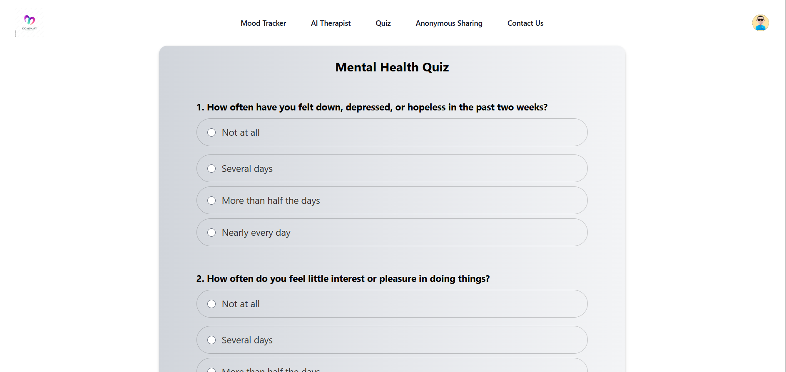

# MentalHealthApp  

MentalEase is a comprehensive mental health application built using the MERN stack. It offers several features to help users manage their mental well-being, including cookie session login, a mood tracker, an AI therapist, a mood quiz, and anonymous sharing.

## Features

### Cookie Session Login
- Secure user authentication using cookie sessions to maintain user login states across different sessions. So also with an unauthorised acces you can't access certain pages of the application. 

### Mood Tracker
- Tracks your daily mood and logs it in the database, allowing users to monitor their mental health over time.

### AI Therapist
- Chat with an AI therapist to discuss your feelings and get instant responses. This feature uses the Gemini API for natural language processing to provide helpful advice and support.

### Mood Quiz
- Take a quiz to understand your current mood better. The responses are analyzed using the Gemini API, and a personalized feedback report is generated based on your answers.

### Anonymous Sharing
- Share your thoughts and feelings anonymously with the community. This feature ensures that users can express themselves freely without revealing their identity.

### CRUD Functionality
- Full CRUD (Create, Read, Update, Delete) operations for user management and article management, allowing users to manage their profiles and content seamlessly.

## Technologies Used

- **MongoDB:** Database to store user data, mood logs, and shared posts.
- **Express.js:** Backend framework to handle API requests and server-side logic.
- **React:** Frontend library to build a responsive and interactive user interface.
- **Node.js:** Runtime environment to execute JavaScript on the server.
- **HTML, CSS, JavaScript:** Core web technologies for building the frontend.
- **RapidAPI:** Platform used to integrate the Gemini API for AI therapist and quiz responses.
- **Gemini API:** Used for natural language processing to power the AI therapist and generate quiz feedback.

## SCREENSHOTS

### Sign Up

### Login

### Home View 1

### Home View 2

### Home View 3

### Profile

### Mood Tracker

### AI CHAT

### QUIZ

### Anonymous Post

### New Post

### Post Platform

### Contact Us

### Access Denied

